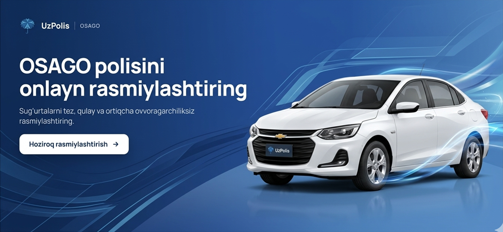

<div align="center">



# UzPolis — Web

**Online insurance marketplace for Uzbekistan.**
Compare, calculate and buy OSAGO, KASKO, travel and other insurance policies in minutes — fully online.

[](https://github.com/j-onfroy/uzpolis-website/actions/workflows/ci.yml)


🌐 **Live:** [uzpolis.uz](https://uzpolis.uz)

</div>

---

## Overview

UzPolis is a B2C insurance platform that lets customers buy mandatory and voluntary insurance
policies without visiting an office. This repository contains the **customer-facing web
application**; it talks to the UzPolis REST API (Spring Boot) and to insurance-company and
payment-provider integrations behind it.

### Key features

- **OSAGO end-to-end flow** — vehicle lookup by plate & tech-passport, premium calculation,
  driver verification by passport, SMS confirmation, contract creation and online payment.
- **Product catalog** — insurance categories, sub-categories and provider products with
  coverage details, pricing and best-seller highlighting.
- **Online payments** — Payme and Click checkout with payment status confirmation.
- **Passwordless auth** — phone number + OTP login with JWT access/refresh token rotation.
- **Multilingual UI** — Uzbek, Russian and English (i18next).
- **Mobile-first** — responsive layout with a native-style bottom dock on mobile.
- **SEO-ready** — meta/OG tags, structured data, `sitemap.xml` and `robots.txt`.

## Tech stack

| Area | Tools |
| --- | --- |
| Framework | React 18, TypeScript, Vite |
| Styling / UI | Tailwind CSS, shadcn/ui (Radix UI), HeroUI, Motion |
| Data fetching | TanStack Query, Axios (interceptors with token refresh queue) |
| Forms | React Hook Form, Zod, input masking |
| Routing | React Router v6 |
| i18n | i18next / react-i18next |
| Testing / quality | Vitest, Testing Library, ESLint |
| Delivery | Docker (multi-stage) + Nginx, GitHub Actions → GHCR → server |

## Architecture

```
src/
├── pages/        # Route-level screens (catalog, product, OSAGO result, payment, profile…)
├── components/   # Feature components (hero calculator, insurance registration wizard…)
│   └── ui/       # Reusable design-system primitives (shadcn/ui based)
├── layout/       # App shells (main layout, auth guard)
├── service/      # Axios instance + typed API modules per domain
├── store/        # TanStack Query hooks (queries & mutations)
├── i18n/         # uz / ru / en translations
├── lib/          # Shared helpers
└── hooks/        # Reusable React hooks
```

**OSAGO purchase flow**

```
Vehicle data ─► Calculate premium ─► Owner & drivers ─► SMS confirm ─► Contract ─► Payme / Click ─► Policy
```

## Getting started

**Prerequisites:** Node.js 20+ and npm.

```bash
git clone https://github.com/j-onfroy/uzpolis-website.git
cd uzpolis-website
cp .env.example .env       # point VITE_API_URL at your API
npm install
npm run dev                # http://localhost:8080
```

### Scripts

| Command | Description |
| --- | --- |
| `npm run dev` | Start the dev server with HMR |
| `npm run build` | Production build into `dist/` |
| `npm run preview` | Preview the production build locally |
| `npm run lint` | Run ESLint |
| `npm test` | Run unit tests (Vitest) |

### Environment variables

| Variable | Description | Default |
| --- | --- | --- |
| `VITE_API_URL` | Base URL of the UzPolis REST API | `https://api.uzpolis.uz` |

## Deployment

The app is shipped as a Docker image: a Node build stage compiles the bundle and an
Nginx stage serves it (gzip, SPA fallback). On push to the `prod` branch, GitHub Actions
builds the image, publishes it to GitHub Container Registry and rolls it out on the server
over SSH with Docker Compose.

```bash
docker build -t uzpolis-web .
docker run -p 10300:10300 uzpolis-web
```

## Branching

| Branch | Purpose |
| --- | --- |
| `main` | Stable, reviewed code (default) |
| `prod` | Production — pushes trigger deployment |
| `feature/*`, `fix/*`, `chore/*`, `docs/*` | Short-lived branches merged via pull request |

## Related projects

- **UzPolis Admin UI** — back-office panel for agents and administrators: [UzPolis-Admin-Web](https://github.com/j-onfroy/UzPolis-Admin-Web)

## Authors

- **Doniyorjon Davlataliyev** — [@j-onfroy](https://github.com/j-onfroy)
- **Jamshid** — [@Jamshdbek](https://github.com/Jamshdbek)

---

<sub>© UzPolis. Source is published for portfolio and reference purposes.</sub>
